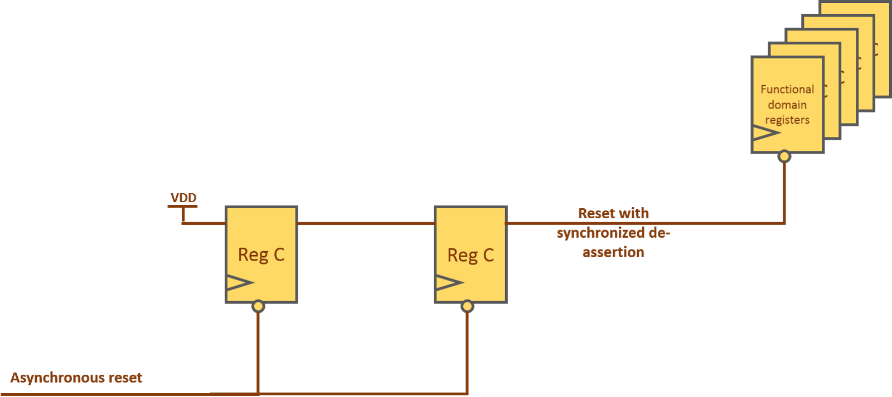

# Asynchronous Assertion, Synchronous Deassertion

For reset signals, it is common to have asynchronous assertion and synchronous deassertion. This means that the reset signal can be asserted at any time, but it will only be deasserted on a clock edge. This is done to ensure that the reset signal is properly synchronized with the clock and does not cause any metastability issues.

Here is a picture to illustrate the concept:

Some code examples use `rst_sync_n = rst_n & rst_n_ff2` to explicitly guarantee asynchronous assertion of the synchronized reset. However, I think both synchronizer flip-flops in this design already have asynchronous reset inputs, so rst_ff2 will be cleared immediately when rst_n is asserted. Therefore, using rst_ff2 directly is usually sufficient.
