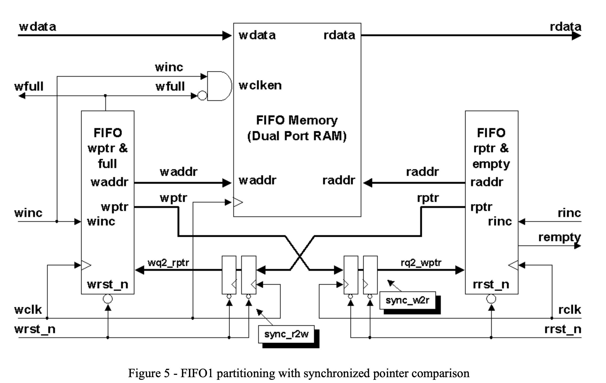

# AsyncFIFO #1

This implementation based on Clifford E. Cummings' "Simulation and Synthesis Techniques for Asynchronous
FIFO Design". FIFO style #1.

## Question

1. Why use next pointer for comparison?
    Since the pointer and the full/empty flag are both registered on the same clock edge, the flag should be computed from the next pointer value. For full detection, we compare the next write Gray pointer with the synchronized read Gray pointer. For empty detection, we compare the next read Gray pointer with the synchronized write Gray pointer. This makes the status flag reflect the FIFO state after the current read or write operation, instead of lagging by one cycle.

2. Noting that a synchronized Gray code that increments twice but is only sampled once will show multi-bit changes in the synchronized value, will this cause multi-bit synchronization problems?
    The answer is no. Synchronizing multi-bit changes is only a problem when multiple bits are changing near the rising edge of the synchronizing clock. The fact that a Gray code counter could increment twice (or more) between slower synchronization clock edges means that the first Gray code change will occur well before the rising edge of the slower clock and only the second Gray code transition could change near the rising clock edge. There is no multi-bit synchronization problem with Gray code counters.

3. Again noting that a faster Gray code counter could increment more than once between the
rising edge of a slower clock signal, is it possible that the Gray code counter from the faster clock domain
could increment to a full-state and to a full+1-state before full is detected, causing the FIFO to overflow
without recognizing that the FIFO was ever full? (This question similarly applies to FIFO empty).
    Because full is generated in the write clock domain using the local write pointer and the synchronized read pointer. The synchronized read pointer may be stale, which only makes the FIFO appear fuller than it actually is. Therefore full may assert conservatively, but the write pointer can never advance past the synchronized read pointer plus the FIFO depth. Overflow cannot occur. The same argument applies symmetrically to underflow and empty detection.

## Design Characteristics

Note that setting either the full flag or empty flag might not be quite accurate if both pointers are incrementing
simultaneously. For example, if the write pointer catches up to the synchronized read pointer, the full flag will be
set, but if the read pointer had incremented at the same time as the write pointer, the full flag will have been set
early since the FIFO is not really full due to a read operation occurring simultaneous to the “write-to-full” operation, but the read pointer had not yet been synchronized into the write-clock domain. The setting of the full flag was slightly too early and slightly pessimistic. This is not a design problem.

Note that the design included in this paper uses different reset signals for the `wclk` and `rclk` domains. The resets
used in this design are intended to be asynchronously set and synchronously removed using the techniques describe
in *Mills and Cummings[2]*.
