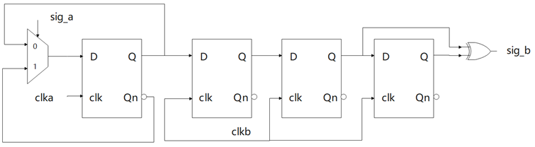

# Toggle Synchronizer

This directory contains a simple implementation of a toggle synchronizer. The toggle signal is toggled whenever the source changes. The destination can then check the toggle bit (rising edge or falling edge) to know when the signal has changed.

Here is a picture to illustrate the concept:

